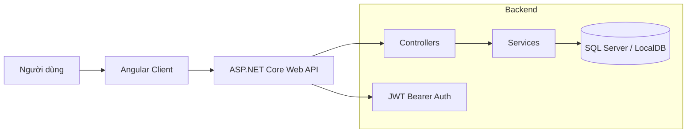
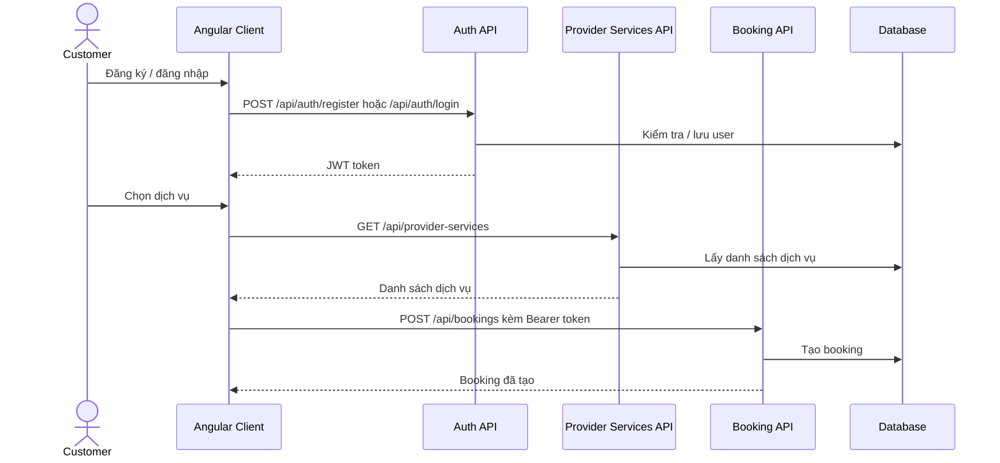

# ServiceBooking

ServiceBooking là hệ thống đặt lịch dịch vụ gồm **ASP.NET Core Web API** cho backend và **Angular** cho frontend. Dự án đang trong giai đoạn xây dựng nền tảng: backend đã có các API chính, EF Core migrations, JWT authentication; frontend đã có cấu trúc Angular và một số page/component, nhưng routing và kết nối API vẫn cần hoàn thiện.

## Tiến độ hiện tại

| Hạng mục | Trạng thái | Ghi chú |
| --- | --- | --- |
| Solution/project structure | Đã có | `ServiceBooking.Api`, `ServiceBooking.Client`, `ServiceBooking.Tests` |
| Database schema | Đã có | EF Core migrations cho User, Customer, Provider, ProviderService, Booking |
| Authentication | Đã có nền tảng | Register/Login, BCrypt password hashing, JWT Bearer |
| Authorization | Đã có | Role-based cho Admin và token-based cho customer/provider workflows |
| User management API | Đã có | CRUD, giới hạn cho Admin |
| Customer profile API | Đã có | Tạo, xem, cập nhật hồ sơ customer |
| Provider profile API | Đã có | Tạo, xem, cập nhật, xóa provider profile |
| Provider service API | Đã có | Xem danh sách, xem theo provider, tạo/xóa dịch vụ của provider |
| Booking API | Đã có | Tạo booking, xem booking, hủy/xác nhận/hoàn thành |
| Swagger UI | Đã có | Bật trong Development |
| Angular app shell | Đang làm | App vẫn còn template mặc định Angular |
| Angular pages/components | Đang làm | Có `home`, `services`, `bookings`, `login`, `register`, `navbar`, `service-card` |
| Angular routing | Chưa hoàn thiện | `app.routes.ts` hiện đang trống |
| Frontend API integration | Chưa hoàn thiện | Một số dữ liệu frontend vẫn là mock data |
| Automated tests | Sơ khởi | Có test project và spec files, chưa có coverage nghiệp vụ rõ ràng |

## Kiến trúc tổng quan



## Luồng đặt lịch



## Công nghệ sử dụng

### Backend: `ServiceBooking.Api`

- .NET 10 Web API
- Entity Framework Core 10
- SQL Server / LocalDB
- JWT Bearer Authentication
- BCrypt.Net-Next
- Swagger / Swashbuckle
- Layered structure: Controllers, Services, DTOs, Models, Data

### Frontend: `ServiceBooking.Client`

- Angular 22
- Standalone components
- Angular Router
- Angular Forms
- RxJS
- Vitest / Angular test tooling

### Tests: `ServiceBooking.Tests`

- .NET test project hiện có file test mẫu.

## Cấu trúc thư mục

```text
ServiceBooking/
|-- ServiceBooking.Api/
|   |-- Controllers/          # API endpoints
|   |-- Data/                 # AppDbContext
|   |-- DTOs/                 # Request/response DTOs
|   |-- Migrations/           # EF Core migrations
|   |-- Models/               # Entity models
|   |-- Services/             # Business logic interfaces/implementations
|   |-- Program.cs            # DI, auth, CORS, Swagger pipeline
|   `-- appsettings.json      # Placeholder config
|
|-- ServiceBooking.Client/
|   |-- src/app/
|   |   |-- components/       # navbar, service-card
|   |   |-- pages/            # home, services, bookings, login, register
|   |   |-- app.config.ts
|   |   |-- app.html
|   |   |-- app.routes.ts
|   |   `-- app.ts
|   |-- angular.json
|   |-- package.json
|   `-- tsconfig*.json
|
|-- ServiceBooking.Tests/
|-- ServiceBooking.slnx
`-- README.md
```

## API hiện có

| Nhóm | Endpoint chính | Mô tả |
| --- | --- | --- |
| Auth | `POST /api/auth/register` | Đăng ký tài khoản |
| Auth | `POST /api/auth/login` | Đăng nhập và nhận JWT |
| Users | `GET/POST/PUT/DELETE /api/users` | Quản lý user, yêu cầu role Admin |
| Customers | `GET /api/customers/profile` | Xem hồ sơ customer hiện tại |
| Customers | `POST /api/customers/create` | Tạo customer profile cho user hiện tại |
| Customers | `PUT /api/customers/update` | Cập nhật customer profile |
| Providers | `GET /api/providers/{id}` | Xem provider public |
| Providers | `POST/PUT/DELETE /api/providers` | Quản lý provider profile của user hiện tại |
| Provider Services | `GET /api/provider-services` | Xem danh sách dịch vụ |
| Provider Services | `GET /api/provider-services/provider/{providerId}` | Xem dịch vụ theo provider |
| Provider Services | `POST /api/provider-services` | Provider tạo dịch vụ |
| Provider Services | `DELETE /api/provider-services/{id}` | Provider xóa dịch vụ |
| Bookings | `POST /api/bookings` | Customer tạo lịch đặt |
| Bookings | `GET /api/bookings/customer` | Customer xem lịch của mình |
| Bookings | `GET /api/bookings/Provider` | Provider xem lịch liên quan |
| Bookings | `PATCH /api/bookings/{id}/cancel` | Hủy lịch |
| Bookings | `PATCH /api/bookings/{id}/confirm` | Xác nhận lịch |
| Bookings | `PATCH /api/bookings/{id}/complete` | Hoàn thành lịch |

## Cài đặt và chạy

### Yêu cầu

- .NET 10 SDK
- Node.js phù hợp với Angular 22
- SQL Server hoặc LocalDB
- Angular CLI nếu muốn dùng lệnh `ng` trực tiếp

### 1. Cấu hình backend

Tạo `ServiceBooking.Api/appsettings.json` hoặc dùng environment variables để cấu hình connection string và JWT.

```json
{
  "ConnectionStrings": {
    "DefaultConnection": "<SET IN appsettings.Development.json OR ENVIRONMENT VARIABLE>"
  },
  "JWT": {
    "Key": "<SET IN appsettings.Development.json OR ENVIRONMENT VARIABLE>",
    "Issuer": "<SET IN appsettings.Development.json OR ENVIRONMENT VARIABLE>",
    "Audience": "<SET IN appsettings.Development.json OR ENVIRONMENT VARIABLE>",
    "ExpirationInMinutes": 60
  }
}
```

### 2. Chạy migration database

```bash
cd ServiceBooking.Api
dotnet ef database update
```

Nếu máy chưa có EF CLI:

```bash
dotnet tool install --global dotnet-ef
```

### 3. Chạy backend API

```bash
cd ServiceBooking.Api
dotnet run
```

Trong môi trường Development, Swagger UI có tại `/swagger` theo URL được in ra trong terminal.

### 4. Chạy frontend

```bash
cd ServiceBooking.Client
npm install
npm start
```

Frontend mặc định chạy tại `http://localhost:4200`.

## Lệnh thường dùng

```bash
# Restore/build toàn solution
dotnet restore
dotnet build

# Chạy backend
cd ServiceBooking.Api
dotnet run

# Chạy Angular dev server
cd ServiceBooking.Client
npm start

# Build Angular
cd ServiceBooking.Client
npm run build

# Chạy test Angular
cd ServiceBooking.Client
npm test
```

## Việc cần làm tiếp

- Thay template mặc định trong `ServiceBooking.Client/src/app/app.html` bằng layout chính của ứng dụng.
- Khai báo routes trong `ServiceBooking.Client/src/app/app.routes.ts` cho các trang `home`, `services`, `bookings`, `login`, `register`.
- Tạo Angular services để gọi API thật thay cho mock data trong UI.
- Lưu và gắn JWT token vào các request cần xác thực.
- Bổ sung guard theo trạng thái đăng nhập và role.
- Hoàn thiện flow booking từ frontend: chọn dịch vụ, tạo lịch, xem trạng thái, hủy lịch.
- Bổ sung seed data hoặc script tạo dữ liệu mẫu.
- Viết unit/integration tests cho service layer và controller layer.

## Ghi chú bảo mật

- Không commit secret thật trong `appsettings.json`.
- `appsettings.json` hiện chỉ chứa placeholder; cấu hình local nên đặt trong `appsettings.Development.json` hoặc environment variables.
- CORS hiện đang cấu hình `AllowAnyOrigin`, phù hợp dev nhanh nhưng cần siết lại trước khi deploy.
